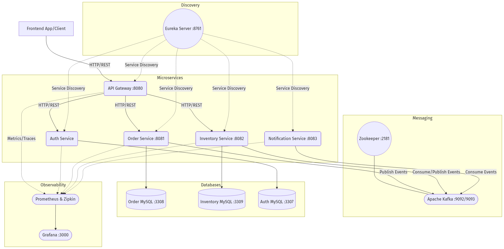
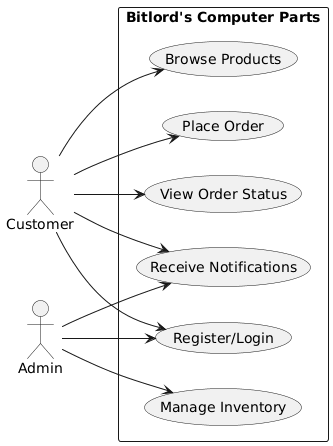
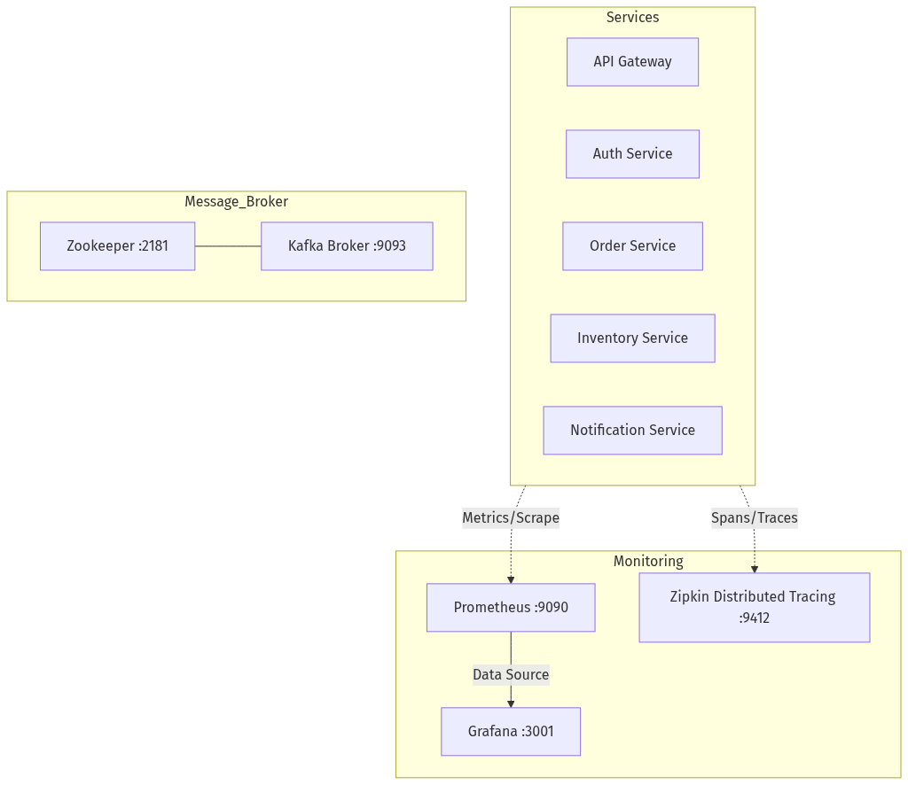

# Bitlord's Computer Parts - Event-Driven Order & Inventory System (Microservices Architecture)

## About This Project
Bitlord's Computer Parts is a robust, scalable backend system designed for a computer hardware retailer. It manages product orders, tracks real-time inventory levels, and notifies stakeholders of critical events. 

The system is built on an **Event-Driven Microservices Architecture** using **Java 17, Spring Boot 3.2, and Apache Kafka**. It demonstrates modern enterprise patterns including Service Discovery, API Gateway routing, Distributed Tracing, and comprehensive Observability.

## Architecture Highlights
- **Microservices**: Order, Inventory, Notification, Auth
- **Event-Driven Messaging**: Apache Kafka for asynchronous inter-service communication
- **API Gateway**: Spring Cloud Gateway for centralized routing and JWT validation
- **Service Discovery**: Netflix Eureka
- **Observability**: Prometheus, Grafana, Micrometer, and Zipkin (Distributed Tracing)
- **Database**: MySQL with Spring Data JPA/Hibernate

---

## 🧠 System Diagrams

### 🔷 High-Level Architecture


---

### 🔷 Use Case Diagram


---

### 🔷 Observability And Infrastructure


---

### 🔷 Kafka Listener Architecture


---

## Repositories (Services)

This project is broken down into modular repositories (services). Click on each to learn more about their specific endpoints and responsibilities:

| Service | Repository | Description |
|---|---|---|
| 🌐 API Gateway | [API-Gateway-BitLord-Computers](https://github.com/MalingaBandara/API-Gateway-BitLord-Computers) | Single entry point, routing & JWT validation |
| 🔐 Auth Service | [Auth-Service-BitLord-Computers](https://github.com/MalingaBandara/Auth-Service-BitLord-Computers) | JWT authentication & user registration |
| 🔍 Eureka Server | [Eureka-Service-Registry-BitLord-Computers](https://github.com/MalingaBandara/Eureka-Service-Registry-BitLord-Computers) | Service registry and discovery |
| 📦 Order Service | [Order-Service-BitLord-Computers](https://github.com/MalingaBandara/Order-Service-BitLord-Computers) | Manages order placement and lifecycle |
| 🏭 Inventory Service | [Inventory-Service-BitLord-Computers](https://github.com/MalingaBandara/Inventory-Service-BitLord-Computers) | Manages stock levels and reservations |
| 🔔 Notification Service | [Notification-Service-BitLord-Computers](https://github.com/MalingaBandara/Notification-Service-BitLord-Computers) | Email and system alerts via Kafka |
| 🖥️ Frontend Application | [Frontend-Application-BitLord-Computers](https://github.com/MalingaBandara/Frontend-Application-BitLord-Computers) | React UI for customers and admins |

## Core Use Cases
1. **Order Placement & Inventory Reservation**: A customer places an order via the API Gateway. The Order Service creates a `PENDING` order and publishes an `order-placed` event. The Inventory Service consumes this, reserves stock, and publishes an `inventory-reservation-result`. The Order Service then updates the order to `CONFIRMED` or `FAILED`.
2. **Low Stock Alerts**: If an order reduces a product's stock below the defined threshold, the Inventory Service publishes a `low-stock-alert` event. The Notification Service consumes this and emails the warehouse administrators.
3. **Status Notifications**: Any change in order status (e.g., `CONFIRMED`, `SHIPPED`, `DELIVERED`) triggers an `order-status-updated` event, which the Notification Service uses to keep the customer informed.

## System Endpoints (via API Gateway - Port 8080)
- **Orders**: `POST /api/orders`, `GET /api/orders`, `GET /api/orders/{id}`, `PATCH /api/orders/{id}/status`
- **Inventory**: `GET /api/inventory`, `GET /api/inventory/{sku}`, `POST /api/inventory`, `PATCH /api/inventory/{sku}/adjust`
- **Auth**: `POST /api/auth/login`, `POST /api/auth/register`

## Getting Started

### Prerequisites
- Docker & Docker Compose
- Java 17 & Maven
- Node.js (for frontend)

### Running the Infrastructure
The project includes a `docker-compose.yml` file that provisions all required infrastructure:
```bash
docker-compose up -d
```
This will start:
- Apache Kafka & Zookeeper
- MySQL
- Zipkin (Tracing)
- Prometheus & Grafana (Observability)

### Running the Services
Start the services in the following order using `mvn spring-boot:run` in their respective directories:
1. `eureka-server` (Port 8761)
2. `api-gateway` (Port 8080)
3. `auth-service`
4. `order-service` (Port 8081)
5. `inventory-service` (Port 8082)
6. `notification-service` (Port 8083)

Finally, start the frontend application using `npm run dev` in the `frontend` directory.

## Documentation
- **Business Requirements (BRD)**: Details business goals, scope, and rules.
- **Technical Requirements (TRD)**: Details event schemas, database schemas, and architectural diagrams.
